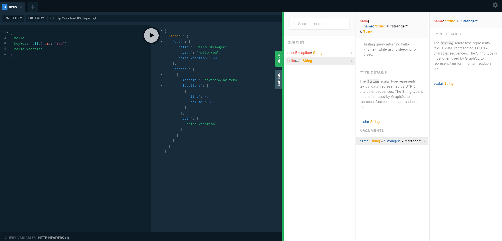
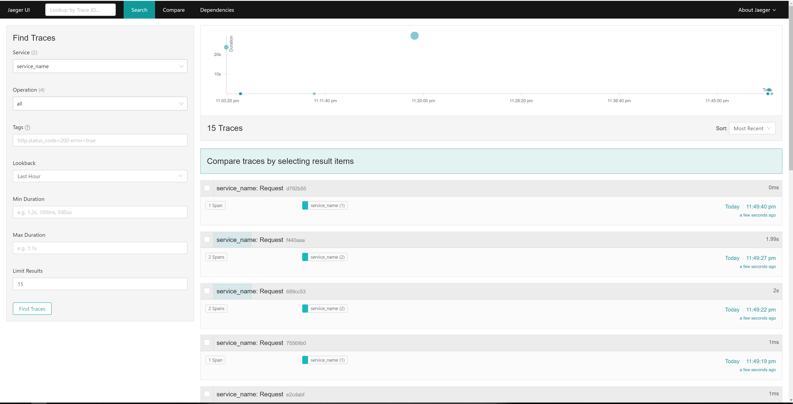

> integrating graphene resolver tracing using zipkin (follows up on zipkin_asgi middleware)

# Intro

Implementation of OpenTracing standard using
- Jaeger - collector/ui (here all-in-one)
- aiozipkin - async compatible zipkin library
- Uvicorn - ASGI
    - Starlette - Framework
        - Graphene - GraphQL Framework

Consists of two middlewares:
1. Traces all traffic going through Starlette
2. Graphene specific middleware that captures traffic going through every resolver 

Note:
Starlette GraphQLApp is patched to allow for `middleware` argument that passes list of graphene specific middlewares. Additionally Prisma playground is added instead of GraphiQL.

## Run Server

```
pipenv run uvicorn app:app --reload
```

Execute queries at [http://localhost:8000/graphql](http://localhost:8000/graphql)




## Run Jaeger all-in-one

Follow instructions at [https://www.jaegertracing.io/docs/1.8/getting-started/](https://www.jaegertracing.io/docs/1.8/getting-started/)
```
$ docker run -d --name jaeger \
  -e COLLECTOR_ZIPKIN_HTTP_PORT=9411 \
  -p 5775:5775/udp \
  -p 6831:6831/udp \
  -p 6832:6832/udp \
  -p 5778:5778 \
  -p 16686:16686 \
  -p 14268:14268 \
  -p 9411:9411 \
  jaegertracing/all-in-one:1.8
```

Trace queries at [http://localhost:16686/](http://localhost:16686/)



