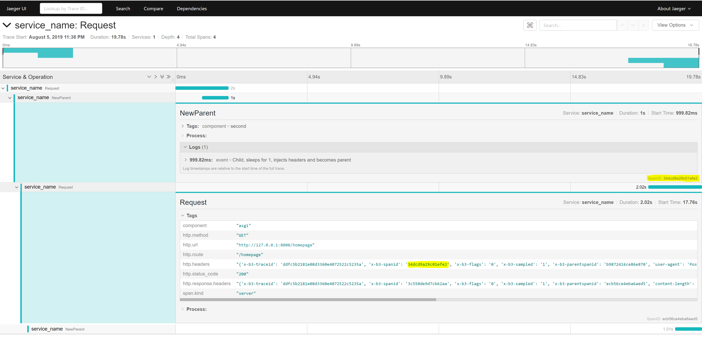

# AioZipkin middleware

- aiozipkin - async compatible zipkin library
- Jaeger - collector/ui (here all-in-one)
  - note - we don't use jaeger agent since it causes issues in pytohn implementation in async (see [#50](https://github.com/jaegertracing/jaeger-client-python/issues/50))

Powered by ASGI Uvicorn and Starlette Framework

## Features
- every call gets traced 
    - (can be disabled, well, by not using the middleware)
- every response injects trace IDs to response headers 
    - (can be disabled via env variable)
- possible to extract trace span inside other part of starlette application and follow up on the trace in any part of the trace resolution
- every call starts a child tracer if incoming request already contains tracing information 
    - (can be disabled via env variable)

## Quick start

### Run Jaeger all-in-one

Follow instructions at [https://www.jaegertracing.io/docs/1.8/getting-started/](https://www.jaegertracing.io/docs/1.8/getting-started/)

```
$ docker run -d --name jaeger \
  -e COLLECTOR_ZIPKIN_HTTP_PORT=9411 \
  -p 5775:5775/udp \
  -p 6831:6831/udp \
  -p 6832:6832/udp \
  -p 5778:5778 \
  -p 16686:16686 \
  -p 14268:14268 \
  -p 9411:9411 \
  jaegertracing/all-in-one:1.8
```

Trace queries at [http://localhost:16686/](http://localhost:16686/)

### Inject middleware

```
import asyncio
import os
import uvicorn
from starlette.applications import Starlette
from starlette.responses import JSONResponse
from starlette.routing import Route

from middlewares.zipkingtracing import (
    ZipkinTracingMiddleware,
)

os.environ["ZIPKIN_AGENT_HOST"] = "localhost"
os.environ["ZIPKIN_AGENT_PORT"] = "9411"
os.environ["ZIPKIN_SERVICE_NAME"] = "MyService"


routes = [
    Route("/", JSONResponse({"status": "OK"})),
]

app = Starlette(debug=True, routes=routes)

app.add_middleware(ZipkinTracingMiddleware)

if __name__ == "__main__":
    uvicorn.run(app, host="0.0.0.0", port=8000, log_level="info", reload=True)
```

Where we use env variables `ZIPKIN_AGENT_HOST`, `ZIPKIN_AGENT_PORT` to point at host (in this context where Jaeger is deployed and listens).

All traffic is captured and available at [http://localhost:16686/](http://localhost:16686/)


## Advanced Tutorial

Users can also nest spans inside the incoming requests using helper functions

- `get_root_span` - extract span context variable
- `init_tracer` - tracer object initiator

```
import asyncio
import os
import uvicorn
from starlette.applications import Starlette
from starlette.responses import JSONResponse
from starlette.routing import Route

from middlewares.zipkingtracing import (
    ZipkinTracingMiddleware,
    get_root_span,
    init_tracer,
)


async def homepage(request):
    root_span = get_root_span()
    tracer = await init_tracer()
    await asyncio.sleep(1)

    with tracer.new_child(root_span.context) as child_span:
        child_span.name("NewParent")
        child_span.tag("component", "second")
        child_span.annotate(
            "Child, sleeps for 1, injects headers and becomes parent"
        )
        await asyncio.sleep(1)

        # ! if headers not explicitly provided,\
        # root span from middleware injects headers
        # and becomes the x-b3-spanid unde which new span is traced
        headers = child_span.context.make_headers()
        return JSONResponse({"hello": "world"}, headers=headers)


routes = [
    Route("/", JSONResponse({"status": "OK"})),
    Route("/homepage", homepage),
]

app = Starlette(debug=True, routes=routes)

app.add_middleware(ZipkinTracingMiddleware)

if __name__ == "__main__":
    uvicorn.run(app, host="0.0.0.0", port=8000, log_level="info", reload=True)
```

This way we are able to followup at the call from a different service. Here we use the same server, but pass the tracing headers to subsequent calls to demonstrate future spans:

### Step by step example:

1. client sends

   ```
   GET /homepage HTTP/1.1
   Host: localhost:8000
   User-Agent: PostmanRuntime/7.15.2
   Accept: */*
   Cache-Control: no-cache
   Postman-Token: 519bda7e-bb9c-40c4-a9a5-c8df5524ced2,189c4252-322a-415d-a637-ecdca9a79cb0
   Host: localhost:8000
   Accept-Encoding: gzip, deflate
   Connection: keep-alive
   cache-control: no-cache
   ```

   Server responds

   ```
   X-B3-TraceId: ddfc5b2181e08d3360e4072522c5235a
   X-B3-SpanId: 34dcd9a29c01efe2
   X-B3-Flags: 0
   X-B3-Sampled: 1
   x-b3-parentspanid: b9872416ce86e870

   {"hello":"world"}
   ```

2. client follows up on first trace by passing the context from headers

   ```
   GET /homepage HTTP/1.1
   Host: localhost:8000
   X-B3-TraceId: ddfc5b2181e08d3360e4072522c5235a
   X-B3-SpanId: 34dcd9a29c01efe2
   X-B3-Flags: 0
   X-B3-Sampled: 1
   x-b3-parentspanid: b9872416ce86e870
   User-Agent: PostmanRuntime/7.15.2
   Accept: */*
   Cache-Control: no-cache
   Postman-Token: 2eb6d43a-ed2c-4291-b0c4-c41335e40f6b,bd6376b5-4ab9-45bd-91ab-10f4831547e7
   Host: localhost:8000
   Accept-Encoding: gzip, deflate
   Connection: keep-alive
   cache-control: no-cache
   ```

   Server responds (again with a new set of optional tracing ids)

   ```
   X-B3-TraceId: ddfc5b2181e08d3360e4072522c5235a
   X-B3-SpanId: 3c550de9d7cb62aa
   X-B3-Flags: 0
   X-B3-Sampled: 1
   x-b3-parentspanid: ecb56ce4eba6aed5

   {
   "hello": "world"
   }
   ```

Both calls are collected by Jaeger and available in WebUI



## Environment variables

- `ZIPKIN_AGENT_HOST = "localhost"`
  - default local host, needs to be set to point at deployed service
- `ZIPKIN_AGENT_PORT = "9411"`
  - default port, where jaeger also listens - no need to adjust
  - make sure to make accessible
- `ZIPKIN_SERVICE_NAME = "service_name"`
  - default port, where jaeger also listens - no need to adjust
- `ZIPKIN_SAMPLING_RATE = "1.0"`
  - zipkin sampling rate, default samples every call
- `ZIPKIN_SAMPLED = "1"`
  - zipkin sampled variable used for root middleware tracer, when no child coming from outside
- `ZIPKIN_INJECT_RESPONSE_HEADERS = "1"`
    - automatically inject response headers 
- `ZIPKIN_FORCE_NEW_TRACE = "0"`
    - if `"1"`, does not create child traces if incoming request contains tracing headers