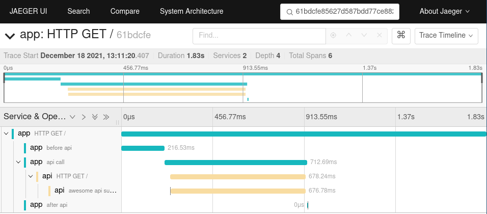

# Example of starlette-zipkin

The following example is a simple docker stack, where a service named `app`,
is calling a service named `api`.

Both services are using `starlette` and `starlette-zipkin`.

## Requirements

The example run a docker stack and requires `docker` and `docker-compose`.


## Start the stack

```bash
$ docker-compose-up
```

## Call the app

```bash
$ curl http://localhost:8000
{"trace_id":"61bdcfe85627d587bdd77ce882473aad"}
```

### Check the result

Then you can visite the jaeger service, running at

[http://localhost:16686/](http://localhost:16686/) and paste the trace_id.



